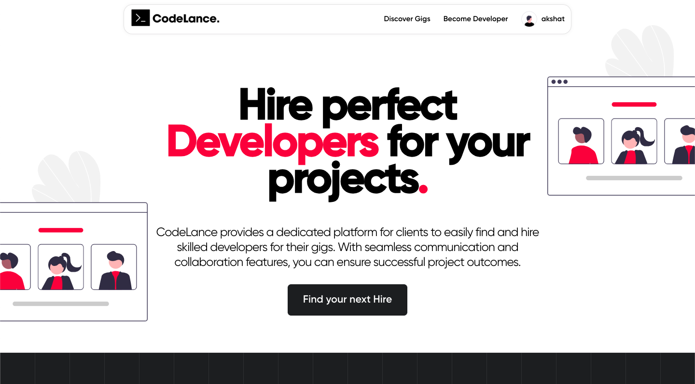

<h1 align="center"></h1>

<p align="center">
  <strong>AI-Powered Freelance Marketplace — Connect Clients with Skilled Workers for Local Micro-Jobs</strong>
</p>

<p align="center">
  <a href="https://codelance-akshat.netlify.app">Live Demo</a> •
  <a href="#features">Features</a> •
  <a href="#tech-stack">Tech Stack</a> •
  <a href="#getting-started">Getting Started</a> •
  <a href="#api-overview">API Overview</a>
</p>

---

## Preview



## About

**CodeLance** (also branded as **TaskLink**) is a full-stack micro-job marketplace where clients can post small tasks — repairs, tutoring, design, tech help, and more — and nearby workers can bid on them. The platform uses **AI-powered worker ranking** to recommend the best-fit workers based on performance, reputation, skill match, price competitiveness, and location proximity.

### Key Highlights

- **Location-Based Job Allocation** — Workers see jobs only in their city/region.
- **AI Worker Ranking** — Multi-dimensional scoring (performance, reputation, skills, price, location) sorts workers by fit.
- **Voice-to-Job Parsing** — Speak your job requirements; the platform auto-fills category, budget, location, and skills.
- **Real-Time Messaging** — Built-in chat between clients and workers.
- **Razorpay Payment Gateway** — Secure, end-to-end payment processing.

---

## Features

| Feature | Description |
|---|---|
| **User Authentication** | Register/Login with JWT-based sessions, bcrypt password hashing, auto-logout after 30 min inactivity |
| **Browse Gigs** | Filter by category, price range, search query, and sort options |
| **Post a Job** | Create gigs with title, description, category, price, delivery time, and features; voice input support |
| **Bidding System** | Workers place bids; AI ranks them by a composite score |
| **AI Worker Ranking** | 5-dimension scoring: performance (30%), reputation (25%), skill match (20%), price (15%), location (10%) |
| **Location Allocation** | Same-city workers get priority allocation for nearby jobs |
| **Orders Dashboard** | View bookings, allocated jobs, and same-city worker recommendations |
| **Real-Time Chat** | Per-conversation messaging with read/unread tracking |
| **Razorpay Payments** | Create orders, verify HMAC-SHA256 signatures |
| **Responsive Design** | Mobile-friendly UI with custom Gilroy font family |

---

## Tech Stack

| Layer | Technology |
|---|---|
| **Frontend** | React 18, React Router v6, Axios, @tanstack/react-query v5, CSS |
| **Backend** | Node.js, Express 4 (ES Modules) |
| **Database** | MongoDB + Mongoose 8 |
| **Auth** | JSON Web Tokens, bcrypt |
| **Payments** | Razorpay SDK |
| **Voice Input** | Web Speech API |
| **Hosting** | Netlify (frontend), Render (backend API) |

---

## Project Structure

```
codelance/
├── frontend/                    # React SPA
│   ├── public/                  # Static assets, manifest, _redirects
│   ├── src/
│   │   ├── components/          # Navbar, Footer, GigCard, CatCard, RankedWorkers, etc.
│   │   ├── pages/               # Home, Gigs, Gig, Add, MyGigs, Orders, Messages, Login, etc.
│   │   ├── utils/               # Axios client, voice parser, reducer, auto-logout hook
│   │   ├── styles/              # 16 CSS modules (one per page/component)
│   │   ├── assets/              # Images, icons, fonts
│   │   ├── data.js              # Static mock data
│   │   ├── App.js               # Root with React Router
│   │   └── index.js             # Entry point
│   ├── .env                     # REACT_APP_API_URL
│   └── package.json
│
├── server/                      # Express REST API
│   ├── controllers/             # Auth, User, Gig, Bid, Order, Conversation, Message, Review
│   ├── models/                  # Mongoose schemas (User, Gig, Order, Bid, Conversation, Message, Review)
│   ├── routes/                  # Express routers
│   ├── middleware/              # JWT verification
│   ├── utils/
│   │   ├── workerRanking.js     # AI scoring & ranking engine
│   │   ├── locationAllocation.js# Location-based job matching
│   │   ├── voiceParser.js       # NLP voice transcript parser
│   │   └── createError.js       # Error factory
│   ├── server.js                # Express entry point
│   ├── .env                     # MONGO, JWT_KEY, PORT, Razorpay keys
│   └── package.json
│
└── README.md
```

---

## Getting Started

### Prerequisites

- Node.js >= 18
- MongoDB (local or Atlas)
- Razorpay test account (for payments)

### Server Setup

```bash
cd server
npm install
```

Create `server/.env`:

```env
MONGO=mongodb+srv://<user>:<pass>@<cluster>.mongodb.net/codelance
JWT_KEY=your_jwt_secret
PORT=8800
RAZORPAY_KEY_ID=rzp_test_xxxx
RAZORPAY_KEY_SECRET=your_secret
```

Start the server:

```bash
npm start        # nodemon server.js
```

### Frontend Setup

```bash
cd frontend
npm install
```

Create `frontend/.env`:

```env
REACT_APP_API_URL=https://devfreelance.onrender.com/api/
```

Start the dev server:

```bash
npm start        # react-scripts start on port 3000
```

Build for production:

```bash
npm run build
```

---

## API Overview

| Method | Endpoint | Auth | Description |
|---|---|---|---|
| POST | `/api/auth/register` | — | Register new user |
| POST | `/api/auth/login` | — | Login, returns JWT cookie |
| POST | `/api/auth/logout` | — | Clear auth cookie |
| GET | `/api/users/:id` | — | Get user profile |
| GET | `/api/users/:id/allocated-jobs` | JWT | Location-based job allocation |
| GET | `/api/users/:id/same-city-workers` | JWT | Workers in same city |
| GET | `/api/gigs` | — | List gigs with filters |
| GET | `/api/gigs/single/:id` | — | Get single gig |
| POST | `/api/gigs` | JWT | Create gig |
| PUT | `/api/gigs/:id` | JWT | Update gig |
| DELETE | `/api/gigs/:id` | JWT | Delete gig |
| POST | `/api/bids` | JWT | Place a bid |
| GET | `/api/bids/job/:jobId` | — | Get bids for a job |
| GET | `/api/jobs/:jobId/recommendation` | — | AI-ranked worker recommendations |
| GET | `/api/orders` | JWT | Get user's orders |
| POST | `/api/orders/create-razorpay-order/:id` | JWT | Create Razorpay order |
| POST | `/api/orders/verify-razorpay-payment` | JWT | Verify payment signature |
| GET | `/api/conversations` | JWT | List conversations |
| POST | `/api/conversations` | JWT | Create conversation |
| GET | `/api/conversations/single/:id` | JWT | Get conversation |
| PUT | `/api/conversations/:id` | JWT | Mark as read |
| GET | `/api/messages/:id` | JWT | Get messages |
| POST | `/api/messages` | JWT | Send message |

---

## AI Ranking Engine

The worker ranking system (`server/utils/workerRanking.js`) computes a composite `aiScore` for each bid using five weighted dimensions:

| Dimension | Weight | Factors |
|---|---|---|
| Performance | 30% | On-time rate, completed jobs, response time, acceptance rate |
| Reputation | 25% | Rating, reliability score, total reviews |
| Skill Match | 20% | Canonical skill aliases, exact + partial token matching |
| Price | 15% | Inverse of bid amount relative to the lowest bid |
| Location | 10% | Same city = 100, same state = 70, 50%+ token overlap = 80 |

Workers with `aiScore >= 70` are flagged as **recommended**.

---

## Voice-to-Job Parsing

Users can dictate job details via the Web Speech API. The parser (`server/utils/voiceParser.js`) extracts:

- **Category** — Keyword matching (plumbing, tutoring, design, etc.)
- **Budget** — Regex extraction (`budget is Rs 500`)
- **Location** — Regex extraction (`in Mathura`)
- **Skills** — Derived from category + trigger words

---

## Deployment

- **Frontend**: Deployed on Netlify at [codelance-akshat.netlify.app](https://codelance-akshat.netlify.app) (SPA routing handled via `public/_redirects`)
- **Backend**: Deployed on Render at `https://devfreelance.onrender.com`

---

## Contact

<h3 align="center"><code>Akshat Jalan</code></h3>
<p align="center">
  <a href="https://github.com/Akshatjalan"></a>
  <a href="https://www.linkedin.com/in/akshat-jalan/"></a>
  <a href="https://www.instagram.com/akshatxjalan/"></a>
  <a href="mailto:jalanakshat2@gmail.com"></a>
</p>
